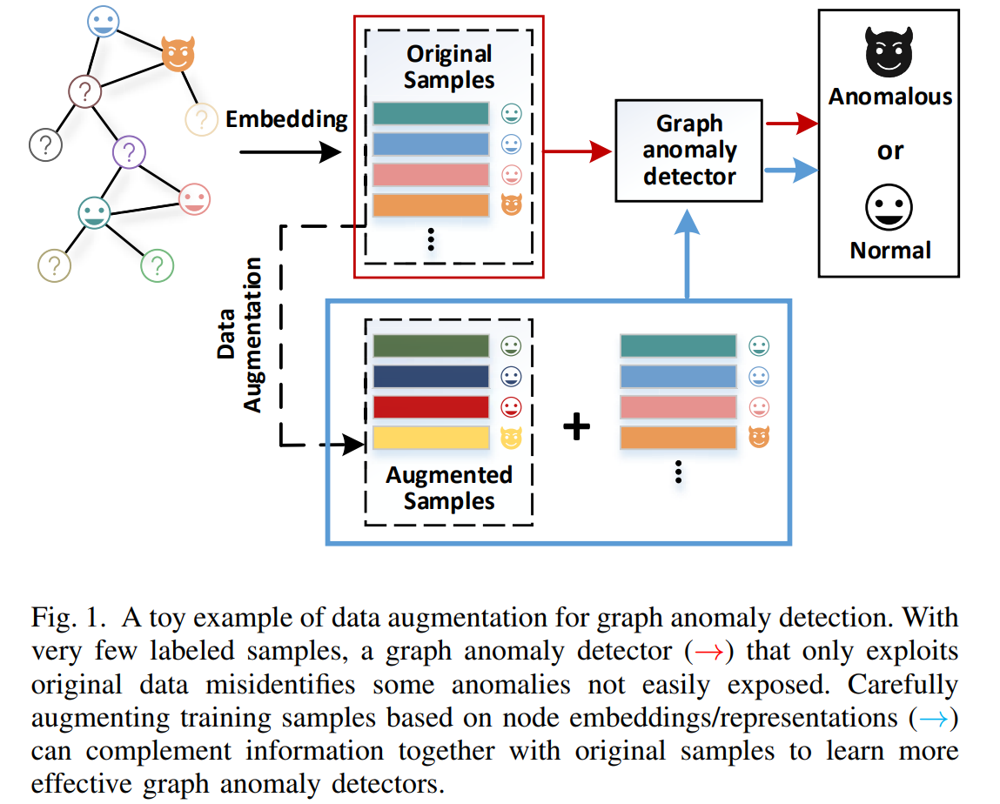
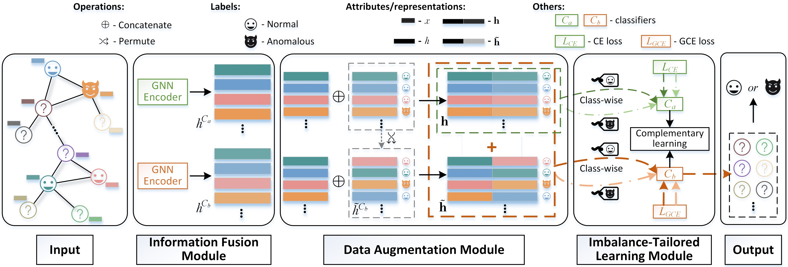

# DAGAD: Data Augmentation for Graph Anomaly Detection

## Introduction
DAGAD is a data augmentation-based framework for graph anomaly detection, providing a promising solution to alleviating the problem of graph anomaly detection with **anomalous sample scarcity** [[1](#references)] and  **class imbalance** [[2](#references)]. 

### Motivation
<p align="center">
	
</p>

### Framework
<p align="center">
	
</p>

Three key modules of DAGAD are summarized as follows: 
1) The **Information Fusion Module** takes the advantage of graph neural networks in fusing graph topology and node attribute information into node representations. DAGAD adopts GNNs (e.g., GCN [[3](#references)] and GAT [[4](#references)]) as an encoder to aggregate information from neighborhoods. 
2) The **Data Augmentation Module** derives additional training samples from the embedding space captured by the Information Fusion Module, which provides a promising solution to the **anomalous sample scarcity** issue. 
3) The **Imbalance-tailored Learning Module** mitigates the tendency of a classifier to be biased towards normal classes while under-training the anomalous class. It balances the contributions from the minority (anomalous) and majority (normal) classes through employing class-wise losses instead of standard instance-wise ones.

For more details, you can find the paper [[here](https://ieeexplore.ieee.org/document/10027747)].

## Implementation
### DAGAD
#### Requirements:
| Language/Package  | Version      | Source |
| :----:            | :----:       | :----: | 
| Python            | 3.7.11       | https://www.python.org/ |
| Pytorch           | 1.10.0+cu102 | https://pytorch.org/ |
| PyTorch Geometric | 2.0.2        | https://pytorch-geometric.readthedocs.io/en/latest/ | 
| NumPy             | 1.21.4       | https://numpy.org/|

#### Datasets:
All datasets used in experiments can be found at https://github.com/kaize0409/GCN_AnomalyDetection_pytorch/tree/main/data.

#### Parameter Setting:

Some random settings, including the data split for training and test, the permutation performed for data augmentation, and the initialization of neural networks' parameters, could cause fluctuations in results, but the overall performance of our framework DAGAD remains better than baselines. The random permutation could bring not only benefit to the augmented samples but also noise, which leads to the fluctuating results. Our future work is expected to cover this issue.

`
**To be Noted!** Instead of using the traditional setting (80% data for traininig and 20% data for testing) in semi-supervised graph learning tasks, our experiments only used 20% of data for training and 80% for testing to compare the performance of baselines and DAGAD.
`

#### How to Run:
```
python main.py
```

### Baseline - GCN-Detector [[3](#references)]
It is an anomaly detector composed of a 2-layered graph convolutional network encoder and one fully connected layer that assigns labels to nodes directly. 
The implementation can be found at https://github.com/tkipf/gcn.

### Baseline - GAT-Detector [[4](#references)]
It adopts a 2-layered graph attention neural network for guiding the information aggregation process in graph representation learning, and nodes are then identified as anomalous or normal using their representations. The implementation can be found at https://github.com/PetarV-/GAT.

### Baseline - GraphSAGE-Detector [[5](#references)]
It samples neighboring nodes for generating node representations and inductively spots anomalous nodes. The implementation can be found at https://github.com/williamleif/GraphSAGE.

### Baseline - GeiniePath-Detecor [[6](#references)]
It takes a new neighbor information filtering process in GCN by exploring informative subgraphs and paths for graph anomaly detection.
The implementation can be found at https://github.com/pygod-team/pygod.

### Baseline - FdGars [[7](#references)]
It aims at detecting anomalies in online review networks by modeling their behavioral features and relationships from the review logs.
The implementation can be found at https://github.com/pygod-team/pygod.

### Baseline - DONE [[8](#references)]
It is an Autoencoder-based anomaly detection model that identifies anomalous nodes with regard to their high structure and attribute reconstruction error. Each node’s anomaly score is automatically learned through the learning process and top-K nodes with higher scores are identified as anomalies.
The implementation can be found at https://github.com/pygod-team/pygod.

### Baseline - ADONE [[8](#references)]
It further extends DONE under a generative-adversarial neural network framework to learn the anomaly scores and depicts anomalies in the same way
as DONE. The implementation can be found at https://github.com/pygod-team/pygod.

### Baseline - DOMINANT [[9](#references)]
It adopts GCN for encoding the graph and reconstructs node attributes and graph topology using two different decoders. Each node is assigned an anomaly score with regard to its reconstruction error. Its implementation can be found at https://github.com/kaize0409/GCN_AnomalyDetection_pytorch.

### Baseline - AnomalyDAE [[10](#references)]
It employs an encoder with graph attention layers for encoding the graph and a fully connected neural network for encoding node attributes.
Similar to DOMINANT, anomaly scores are calculated based on the reconstruction loss. The implementation can be found at https://github.com/haoyfan/AnomalyDAE.

### Baseline - OCGNN [[11](#references)]
It adopts hypersphere learning to the decision boundaries between anomalies and normal nodes. The one-class graph neural network is trained using normal data, and it identifies anomalies as nodes that are precluded from the learned hypersphere. The implementation can be found at https://github.com/WangXuhongCN/myGNN.

## Cite
Please cite our paper if you use this code in your own work:

        @inproceedings{liu2022DAGAD, 
    	    author = {Liu, Fanzhen and Ma, Xiaoxiao and Wu, Jia and Yang, Jian and Xue, Shan and Beheshti, Amin and  
                          Zhou, Chuan and Peng, Hao and Sheng, Quan Z. and Aggarwal, Charu C.},
    	    title = {DAGAD: Data augmentation for graph anomaly detection},
    	    booktitle = {ICDM},
    	    year = {2022},
		    pages={259-268},
		    doi={10.1109/ICDM54844.2022.00036},
        }

## References

[1] [Liu et al., eRiskCom: an e-commerce risky community detection platform, VLDB J., 2022](https://link.springer.com/article/10.1007/s00778-021-00723-z)

[2] [Ma et al., A comprehensive survey on graph anomaly detection with deep learning, IEEE Trans. Knowl. Data Eng., 2021](https://ieeexplore.ieee.org/abstract/document/9565320)

[3] [T. N. Kipf and M. Welling, Semi-supervised classification with graph convolutional networks, ICLR, 2017](https://arxiv.org/abs/1609.02907)

[4] [P. Veličković et al., Graph attention networks, ICLR, 2018](https://arxiv.org/abs/1710.10903)

[5] [W. L. Hamilton et al., Inductive representation learning on large graphs, NeurIPS, 2017](https://proceedings.neurips.cc/paper/2017/hash/5dd9db5e033da9c6fb5ba83c7a7ebea9-Abstract.html)

[6] [Z. Liu et al., GeniePath: Graph neural networks with adaptive receptive paths, AAAI, 2019](https://ojs.aaai.org/index.php/AAAI/article/view/4354)

[7] [J. Wang et al., FdGars: Fraudster detection via graph convolutional networks in online app review system, WWW, 2019](https://dl.acm.org/doi/10.1145/3308560.3316586)

[8] [S. Bandyopadhyay et al., Outlier resistant unsupervised deep architectures for attributed network embedding, WSDM, 2020](https://dl.acm.org/doi/10.1145/3336191.3371788)

[9]  [K. Ding et al., Deep anomaly detection on attributed networks, SDM, 2019](https://epubs.siam.org/doi/abs/10.1137/1.9781611975673.67)

[10] [H. Fan et al., AnomalyDAE: Dual autoencoder for anomaly detection on attributed networks, ICASSP, 2020](https://ieeexplore.ieee.org/document/9053387)

[11] [X. Wang et al., One-class graph neural networks for anomaly detection in attributed networks, Neural Comput. Appl., 2021](https://link.springer.com/article/10.1007/s00521-021-05924-9)
